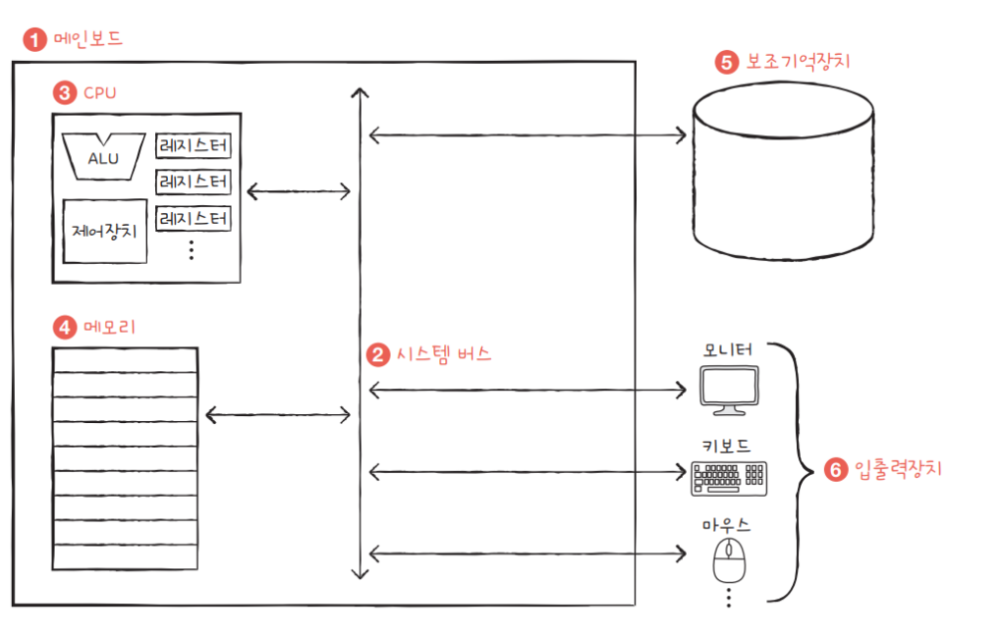

# 🔹 1_1. 기본 구성 요소 🔹

- 상위 수준에서 **컴퓨터**는 **처리기, 메모리, 입출력** 요소들로 구성되어 있으며,  
  이들마다 하나 이상의 모듈로 존재합니다.
- 이러한 요소들은 **컴퓨터의 주요 기능**(프로그램 수행)을 위해 연결되어 있습니다.

---

## 🟣 처리기 (Processor)

- **컴퓨터의 동작을 제어**하고 **데이터를 처리**합니다.
- 처리기가 하나만 존재할 경우 **중앙처리장치 (CPU)**라고 불립니다.

---

## 🟣 주기억장치 (Main Memory)

- **데이터**와 **프로그램**을 저장합니다.
- 일반적으로 **휘발성(volatile)**이에 해당됩니다.
- **컴퓨터가 셧다운된다면** 이 안의 정보는 **소멸됩니다**.
- 이에 대비해, **디스크**는 셧다운 후에도 데이터를 **유지합니다**.
- 주기억장치는 **실기억장치(real memory)**, **주메모리(primary memory)**로 불리기도 합니다.

---

## 🟣 입출력 모듈 (I/O Module)

- **컴퓨터**와 **외부 환경** 간의 데이터 이동을 담당합니다.
- 이 외부 환경은 **보조기억장치, 통신장비, 단말기** 등을 포함합니다.

---

## 🟣 시스템 버스 (System Bus)

- 처리기, 주기억장치, 입출력 모듈 간의 **통신**을 제공합니다.
- **데이터**, **주소**, **제어**버스로 구성되어 있습니다.

> 🔹 [참고 자료 - 링크 이동](https://dheldh77.tistory.com/entry/%EC%BB%B4%ED%93%A8%ED%84%B0%EA%B5%AC%EC%A1%B0-%EC%8B%9C%EC%8A%A4%ED%85%9C-%EB%B2%84%EC%8A%A4System-bus)

---

> [**CPU 구조- 이동**](./cpu/cpu_componant..md)   
> [**레지스터- 이동**](./cpu/register_1.md)

---

# 🔹 1_2. 명령어 수행 🔹

> **프로그램은 처리기에 의해 수행됩니다.**  
> 이는 **메모리에 저장되어 있는 명령어들의 집합**입니다.

> 간단하게 말해, **명령어 수행**은 **명령어 반입(instruction fetch)**과 **명령어 실행(instruction execution)**의 반복이라는 단계로 구성됩니다.

---

## 🟣 명령어 사이클 (Instruction Cycle)

- **기본적으로 처리기의 수행 단계**입니다.
- 하나의 명령어를 수행하기 위해 이 과정을 반복합니다.

---

### 🔹 처리기가 사용하는 다른 기법들 🔹

- **파이프라이닝 (Pipelining)**  
  -> 동시에 여러 단계에서 다른 명령어를 처리함으로써 성능을 향상합니다.

- **병렬 처리 (Parallel Processing)**  
  -> 한 개 이상의 실행 유닛을 활용합니다.

- **분기 예측 (Branch Prediction)**  
  -> 조건문이나 반복의 결과를 미리 예측합니다.

- **슈퍼스칼라 (Superscalar)**  
  -> 하나의 처리기에 **복수의 ALU**를 포함합니다.

- **인터럽트를 처리 (Interrupt Handling)**  
  -> 외부 장치로부터의 인터럽트를 우선적으로 처리합니다.

---

> 🔹 **명령어 사이클**은
> - **메모리로부터** 명령어를 가져온 후
> - **해당 명령어를 실행**합니다.

---

## 🟣 일반적으로 CPU(처리기)가 수행되는 4가지 단계:

1️⃣ **처리기-메모리**  
-> 처리기에서 메모리로, 또는 메모리에서 처리기로 데이터가 전달됩니다.

2️⃣ **처리기-입출력**  
-> 처리기에서 입출력 모듈로, 또는 입출력 모듈에서 처리기로 데이터가 전달됩니다.

3️⃣ **데이터 처리**  
-> 처리기는 데이터에 대한 산술 또는 논리 연산을 수행합니다.

4️⃣ **제어**  
-> 처리기는 **다음에 실행해야 할 명령어**의 주소를 변경합니다.

> 예시:  
>  처리기는 149에서 명령어를 가져온 후,  
>  다음에는 182에서 가져올 수 있도록 PC를 변경합니다.  
>  → 이에 따라 다음 단계에서 150이 아닌 182에서 인출됩니다.

---

## 🟣 프로그램 수행의 예 (레지스터)

> **PC**에는 **첫 번째 명령어의 주소(300)**가 존재합니다.

---

1️⃣ **PC**가 **첫 번째 명령어(1930)**를 가져온 후 **IR**에 적재됩니다.  
이때 **PC**는 1 증가됩니다.

(MAR, MBR의 역할은 간소하게 넘어갑니다)

2️⃣ **IR**의 4비트를 확인합니다. 이는 **메모리에서 AC로 적재**해야 함을 나타내고  
나머지 12비트를 통해 **940**이라는 주소가 전달됩니다.

3️⃣ 다음 명령어(5941)가 301에서 가져온 후 **PC**가 증가됩니다.

4️⃣ **AC**의 이전내용과 **메모리 941**의 값을 더합니다.  
이 결과는 **AC**에 저장됩니다.

5️⃣ 다음 명령어(2941)가 302에서 가져온 후 **PC**가 증가됩니다.

6️⃣ **AC**의 내용을 **메모리 941**에 저장합니다.

