### 1-3. 인터럽트

<aside>
💡

가상적으로 모든 컴퓨터는 처리기의 일반적인 처리에 다른 모듈들(입출력, 메모리)이 **인터럽트**를 ****걸 수 있도록 허용하고 있다.

- **인터럽트**는 **명령어 사이클**과 같은 처리기 작동 절차(흐름)를 끊는 신호 = **인터럽트**라고한다.
</aside>

- **언제 인터럽트가 발생하는가?**
    - CPU가 얼른 처리해야할 작업이 생겼을 때 발생한다

- **인터럽트의 종류**
    - **동기 인터럽트(예외)**
        - CPU가 예기치 못한 상황을 접했을 때 발생 (실행을 중단하고 예외적인 상황을 먼저 처리할 때)
            - 설명: 자바의 예외발생과 동작이 유사하다. (ex. Exception 발생시 모든 메서드 취소됨)
            - 폴트
            - 트랩
            - 중단
            - 소프트웨어 인터럽트
    - **비동기 인터럽트(하드웨어 인터럽트)**
        - 주로 입출력 장치에 의해 발생
            - 설명: 계속해서 알림이 왔는지 확인하기 때문에, 명령어 사이에 인터럽트 확인!
            - 다른 하드웨어가 보내주는 인터럽트
            - 알림과 같은 역할을 한다.
                - <알림역할 - 이미지>
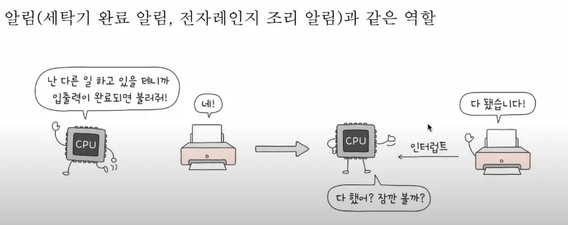

            - 키보드 - 알림
                - 키보드/마우스 입력 시 발생하는 인터럽트에 의해서 CPU는 우선적으로 키보드/마우스 입력 처리를 실행한다. - 하드웨어(키보드/마우스)
                -
- **하드웨어 인터럽트 존재의 이유는?**
    - 입출력 장치는 속도가 CPU에 비해 느리기 때문에, 지속적으로 CPU가 입출력 장치가 작업을 완료되었는지 확인 해야하기 때문이다.
        - <하드웨어 인터럽트-이미지>
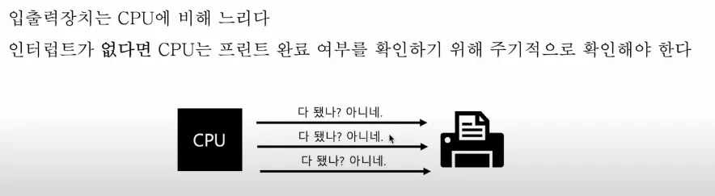

        - 즉 더 효율적이기 때문이다.

- **하드웨어 인터럽트의 처리순서**
    - 인터럽트의 종류를 막론하고 인터럽트 처리 순서는 대동소이하다.
        - <하드웨어 인터럽트 처리순서 - 이미지>
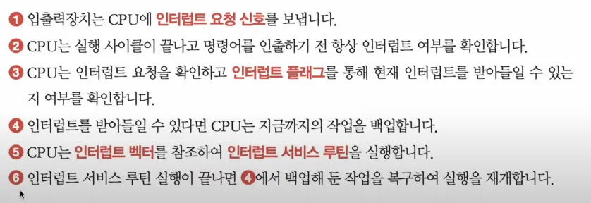

- **인터럽트 요청신호**
    - 하드웨어 장치가 CPU에게 인터럽트 요청을 보내는 신호

- **CPU는 명령어 사이클이 끝나면, 플래그 인터럽트를 주기적으로 확인한다.**
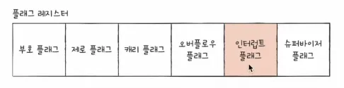

    - 현재 인터럽트를 받을 수 있다 / 없다 를 확인하고, 처리할 수 있다면, CPU가 인터럽트를 처리한다.
        - 하지만,Non maskable interrupt 일 경우, 인터럽트 플레그로 막을 수 없다 왜냐하면, 하드웨어 쪽에서 긴급할 시 사용하는 신호이기 때문이다.
        - <Non maskable interrupt -이미지>
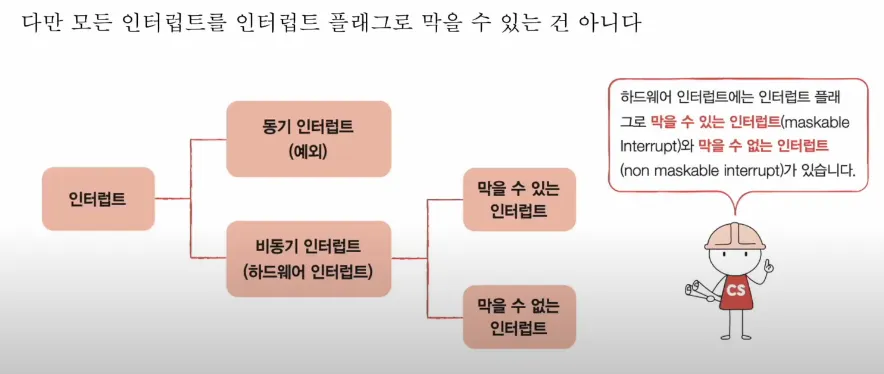

- **인터럽트 서비스 루틴**
    - 인터럽트가 발생했을 때 해당 인터럽트를 어떻게 처리하기 위한 프로그램
        - 키보드가 인터럽트 요청을 보내면 이렇게 처리하세요~
        - 마우스가 인터럽트 요청을 보내면 이렇게 처리하세요~
    - 인터럽트 서비스 루틴도 프로그램이기에 메모리에 저장된다
        - <인터럽트 서비스 루틴 - 이미지>
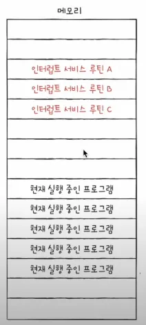

    - **인터럽트가 없다면**
        - 실행중인 프로그램을 정상적으로 순차적 실행을 한다.
    - **인터럽트가 있다면,**
        - 실행중인 프로그램을 중단하고 백업시킨 후, 인터럽트 서비스 루틴을 시작하고 끝낸 후 실행중인 프로그램으로 다시 돌아와 중단된 시점부터 다시 시작함.
            - <인터럽트 벡터 - 이미지>
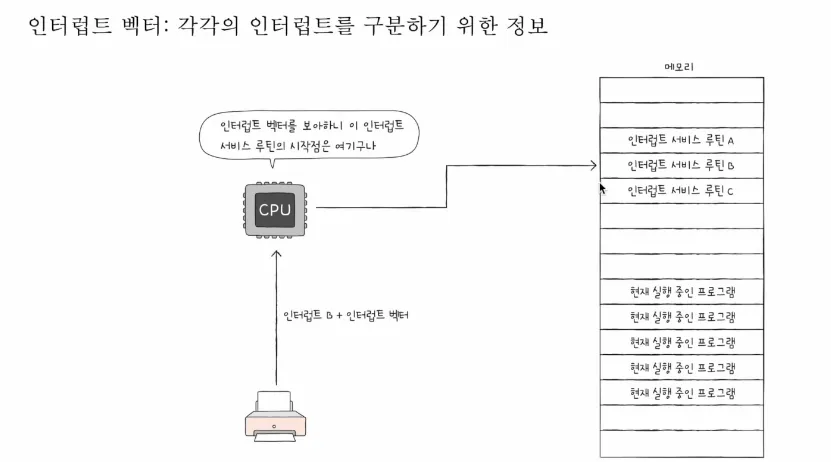

            - **인터럽트 벡터**
                - 인터럽트 서비스 루틴을 식별하기 위한 정보
                - 데이터 버스를 통해서 인터럽트와 함께 전송된다.
                - 인터럽트 신호를 받았을 때, 어떤 인터럽스 서비스 루틴(메모리에서 주소)가 어디인지 찾기 위한 정보도 하드웨어에서 인터럽트와 함께 보내준다.

- **CPU가 인터럽트를 처리한다.**
    - 인터럽트 서비스 루틴을 실행하고, 본래 수행하던 작업으로 다시 되돌아온다.

- **인터럽트 서비스 루틴 처리시, 스택에 기존 정보 백업**
    - <스택 백업 - 이미지>
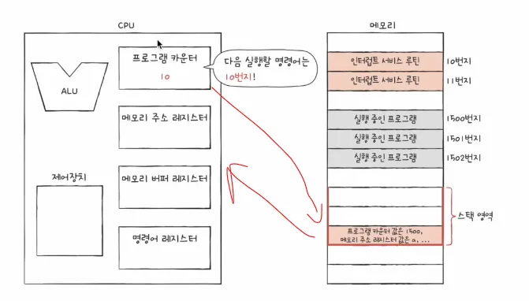

- **정리**
    - <인터럽트 정리 - 이미지>
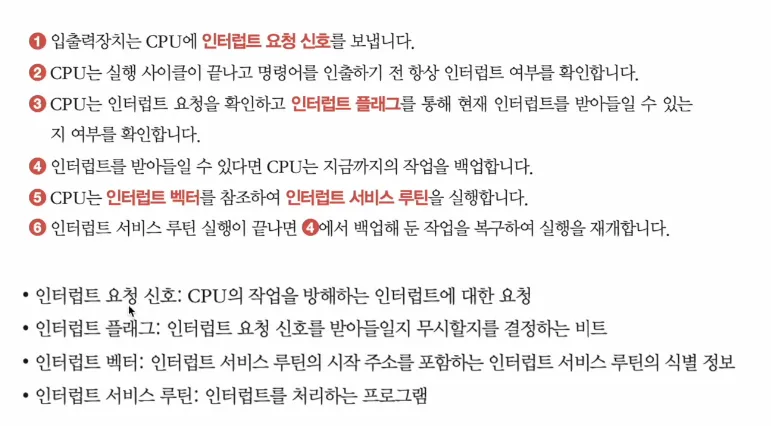

- **<CPU의 처리 실행 과정>**
1. 입출력장치가 인터럽트 시그널을 처리기(cpu)에 보낸다
2. cpu는 명령어처리 후 인터럽트 시그널을 발견한다(확인하고 있다고 가정)
3. 처리기는 입출력장치에 인터럽트 확인했다는 신호를 보낸다(입출력 장치는 인터럽트 신호확인을 cpu로 부터 받으면, 인터럽트 신호를 삭제함)
4. 처리기는 인터럽트가 발생한 지점에서 현재 진행 중인 프로그램에 대한 정보를 처리스택에 저장한다. 최소한의 저장 정보는 프로그램 상태 워드( PSW)이다.
5. 처리기는 데이터 버스를 통해 받은 인터럽트 벡터를 확인하여, 인터럽트 처리 루틴의 시작 명령어 주소를 명령어 카운터에 적재한다.
6. 나머지 레지스터에 대한 정보(인터럽트 이전에 실행 중이던 프로그램에 대한 정보)를 스택에 저장시킨다.
    1. 이유: 인터럽트 처리기에 의해 레지스터 정보가 사용될 수 있기 때문이다.
7. 인터럽트 처리기가 실행된다.
8. 인터럽트 처리 완료 후, 저장된 레지스터 값을 검색하여, 레지스터에 다시 저장한다.
9. 처리스택으로부터 PSW와 프로그램 카운터 값을 인터럽트 발생 이전으로 복원한다.

---

<aside>
💡

인터럽트는 사용자 프로그램 수행 중 어떤 위치에서도 발생할 수 있어서, 인터럽트 발생은 예측 불가능하다.

</aside>

- 중첩 인터럽트
    - 여태까지의 설명은 모두 단일 인터럽트에 대한 설명이고, 중첩인터럽트가 발생했을 때, 처리방법은 아래의 2가지가 대표적이다. (하나의 프로그램이 하나 이상의 장치(입출력)와 연관되어 있을 때 발생, 프린터/통신장치 등)
    - 순차적 인터럽트
        - 인터럽트가 발생하면, 다른 인터럽트의 실행을 막는 방법이다
        - 단점: 우선순위, 긴급 요구를 고려하지 않기 때문에, 장치에서 첫번째 입력에 대한 인터럽트를 보내고, 두번째를 실행시켰는데, 첫번째 인터럽트에 대한 cpu가 처리하지 않아, 첫번째 인터럽트에 대한 데이터가 유실될 수 있다.
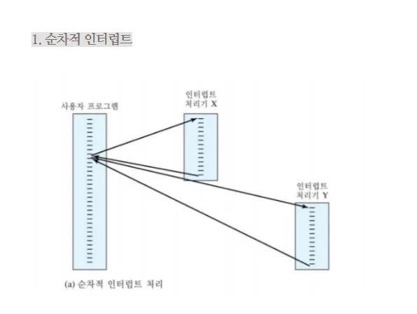

- 우선순위 인터럽트
        - 프린터, 통신 라인, 디스크 순으로 우선 순위를 두어, 인터럽트 발생시 프린터 ISR(인터럽트 서비스 루틴)을 실행하고, 통신라인 인터럽트 발생시 통신ISR을 실행시켜, 우선적인 인터럽트 순으로 실행한다. (인터럽트 실행원리는 단일 인터럽트와 동일)
            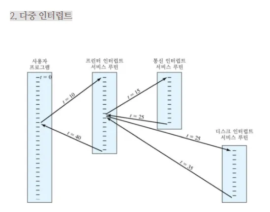
            
  
    
### 1-4. 메모리 계층 구조
    
보통 cpu의 명령어 처리 속도 보통 아래의 경우 빠르고 비싸다.
    
- 메모리 용량이 작을 수록?
- 접근이 빠를 수록
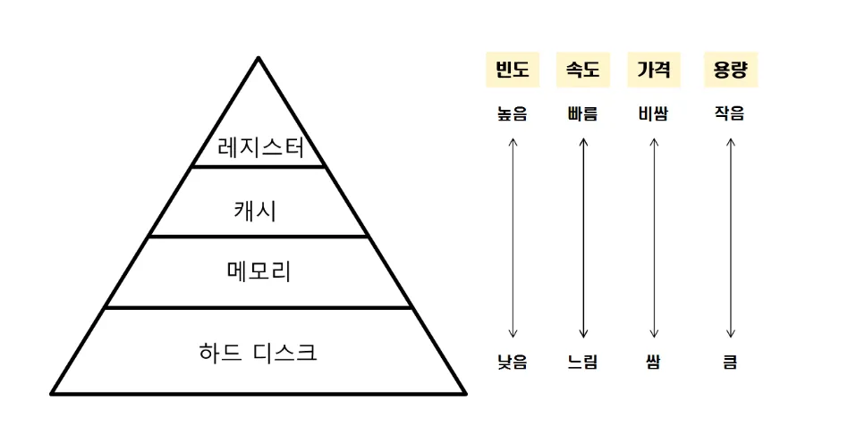

---

### 1-5. 캐시 메모리

- 캐시의 원리
    - 캐시의 목적은 이용 가능한 가장 빠른 메모리의 속도에 근접한 메모리를 제공하는 동시에, 비용이 저렴한 대용량의 메모리를 제공하는 것이다.

<aside>
💡

들어가기에 앞서..

- cpu의 메모리 접근 속도 > cpu의 연산속도 (접근이 더 오래걸린다)
</aside>

- <캐시 메모리를 포함한 계층적 메모리 구조 - 이미지>
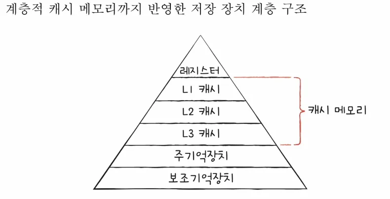

- 캐시의 특징
    - 캐시는 CPU와 메모리 사이에 위치하는 **레지스터** 보다는 **느리고**, **메모리** 보다는 **빠른** 저장공간이다.
    - 캐시는 메모리보다 빠르지만, 용량이 적기 때문에, 모든 메모리의 정보를 저장할 수 없다.
    - CPU의 **지역참조성의** 원리에 따라 캐시는 사용했던 곳 혹은 근처를 저장한다.
    - 캐시 적중률(Hit와 Miss)을 확인하며, 캐시 능률을 확인할 수 있다. 캐시 적중률이 높을 수록 성능이 높다.

- 캐시 Hit/Miss
    - **Hit**:  캐시 메모리에 접근했을 때를 말한다.
    - **Miss**: 캐시 메모리에 접근 하지 못했을 때를 말한다.
    - **캐시 적중률  =  캐시 히트 횟수 / (캐시 히트 횟수 + 캐시 미스 횟수)**

- <캐시메모리 구조 - 이미지>
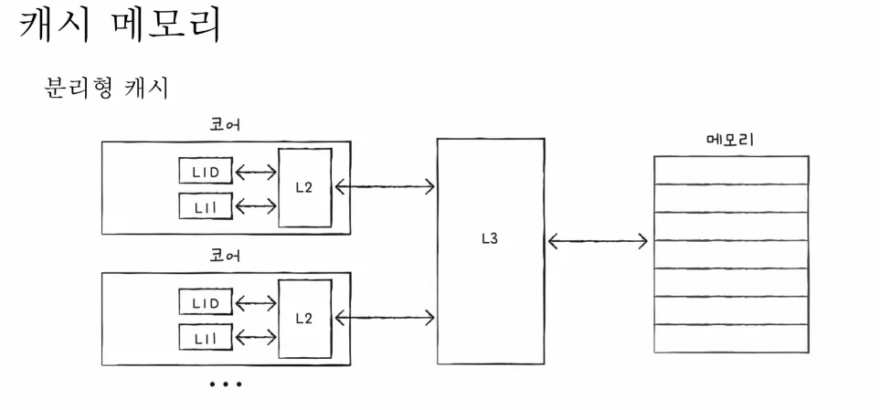

- 일반적인 캐시 메모리는 **SRAM**(정적램)이라고 부르며, **cpu내에** L1, L2 캐시 메모리, **cpu밖에** 위치하는 L3 캐시 메모리로 구성된다. 특히 L1 메모리는 **분리형 캐시구조**로 두기도 하는데, **명령어만을 다루는 L1I**, **데이터만을 다루는  L1D**로 나누는 것이다.
    - 다중 코어로 캐시메모리를 관리할 때에 분리된 cpu에 존재하는 L1, L2 캐시메모리의 싱크를 맞추는 것은 중요하다.

<aside>
💡

<용어 정리>

**워드(Word)**: 워드란, cpu가 한 번에 처리할 수 있는 데이터의 크기 단위이다.

- 예를 들어 32비트 CPU는 **1워드 = 32비트 (4바이트)**
- 64비트 CPU는 **1워드 = 64비트 (8바이트)**

즉, CPU가 메모리에서 값을 읽을 때 **기본적으로 읽어오는 최소 단위**가 **워드**이다.

**블록(Block): 캐시**에서 데이터를 가져올 때 사용하는 **기본 단위**이다.

- cpu가 메모리에서 데이터를 읽을 때, 딱 1개의 데이터(워드)만 가져오는 것이 아니라 주변데이터들 까지 묶어서 가져오는데, 이 묶음 단위가 블록이다. → 라인(Line)이라고도 함.
- cpu의 공간지역성(데이터는 근처의 데이터를 접근할 확률이 높다)를 이용하여, 캐시는 근처의 메모리 데이터를 함께 가져온다.
    - 단점: 블록의 크기가 너무 커져버리면, 캐시 적중률이 떨어져, 성능 저하가 발생한다.
</aside>

- <캐시 공간 지역성 - 이미지 >
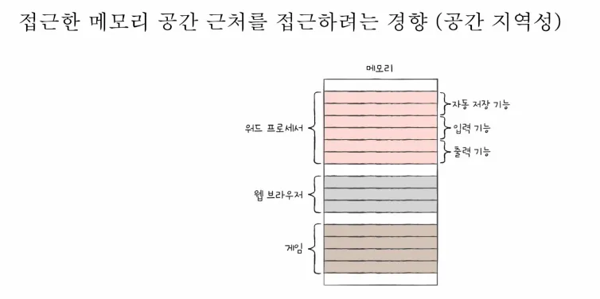
---

### 1-6. 직접 메모리 접근(DMA)

- I/O 연산을 위해 사용하는 기법 중 1개이다. 보통 아래의 2개로 나뉜다.
    - 폴링: I/O 연산이 끝날때 까지 기다림
    - 인터럽트 구동 : 인터럽트 신호를 보내어 cpu가 인터럽트 신호를 받았을 때만 ISR 실행
    - 직접 메모리 접근 : DMA가 cpu 대신 데이터 전달을 처리해주고, cpu는 I/O에 전혀 관여하지 않음.

- 인터럽트 구동
1. I/O 장치가 인터럽트를 발생시킴
2. CPU가 인터럽트 벡터에 따라 ISR(인터럽트 서비스 루틴) 실행
3. CPU가 I/O 장치에서 **직접 한 바이트씩 읽어서** 메모리에 저장
4. 연산 수행

→ 단점: CPU가 **매우 바쁨**, 느림

- 직접 메모리 접근(DMA - cpu 보조역할)
1. CPU는 DMA에게 명령만 내림:

   ➤ "I/O에서 데이터 1,000바이트를 메모리 주소 0x1000부터 저장해!"

2. 그다음 DMA가 직접 I/O ↔ 메모리 사이에서 데이터를 전송

   ➤ 예: 0x1000, 0x1001, 0x1002, ..., 0x13E7까지

3. 전송 끝나면 DMA가 CPU에 **인터럽트로 '전송 완료' 신호**
4. 이제 CPU는 **0x1000~0x13E7 메모리만 읽으면 됨**

<aside>
💡

**DMA모듈**은 데이터를 메모리로부터 또는 메모리로 전송하기 위하여 버스를 제어할 필요가 있다. 버스 사용 경쟁으로 인해, 버스가 필요할 때 프로세서가 입출력 모듈을 기다려야 할 때도 있을 수 있다. 이것은 인터럽트가 아니기 때문에 프로세서는 문맥을 저장하고 다른일을 처리하지 않는다(인터럽트 서비스 루틴처럼 레지스터와 PC의 정보를 처리스택에 저장하지 않는다는 뜻이다. 단지 잠시 기다리기만 할 뿐). 다만, 프로세서는 한 번의 버스 사이클(버스를 통해 한 워드를 전송하는데 걸리는 시간) 동안 일시 정지한다. 전반적으로 볼 때 DMA 전송동안 프로세서의 수행이 조금 느려지게 된다. 그럼에도 불구하고 다수의 워드에 대한 I/O 전송의 경우 DMA가 인터럽트 구동 프로그램된 입출력에 비해 훨씬 효과적이다. (DMA의 **사이클 스틸링**(Cycle Stealing)을 설명하는 것이다 → 즉 cpu의 버스 사용을 DMA가 1사이클을 빌려서 데이터 전송을 한다는 것)

</aside>

- 모듈이란?
    - 시스템 내에서 **하나의 독립된 기능을 수행하는 하드웨어 또는 논리적인 단위**를 의미합니다.
        - 메인보드안에 내장된 물리적 회로이다. → 하드웨어 쪽으로 보자면, 메인보드의 칩셋에 위치한다

      > **메인보드 칩셋**: CPU 외의 모든 장치들(RAM, SSD, USB, 그래픽카드 등)**과 CPU를 연결하고 제어하는 **보조 회로 집합(하드웨어)**입니다.
>