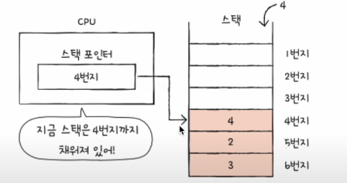
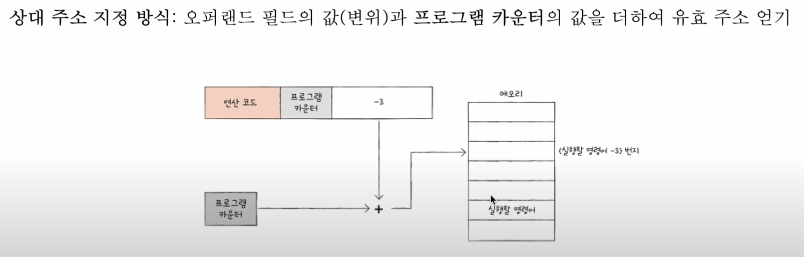

# 🔹 레지스터란?

- CPU는 **명령어를 실행**하기 위해 명령어, 데이터, 다음 명령어의 주소 등을 가져온다.  
  이때 **가장 빠르게 접근 가능한 저장공간**이 바로 **레지스터**이다.

> 🟣 **레지스터는 CPU가 가장 빠르게 접근 가능한 저장공간이다!**  
> (레지스터 < 메모리 < 디스크)

---

## 🔹 레지스터의 종류

---

### 1️⃣ **프로그램 카운터 (PC: Program Counter)**

- **다음에 실행해야 할 명령어의 주소**를 저장한다.
- 보통 **메모리 → 레지스터 → CPU** 순서로 전달된다.
- **메모리 주소 레지스터 (MAR)**가 이 값을 참조하게 된다.
- PC는 매 실행마다 +1된다.

> 특정 메모리로 실행 흐름이 변경되는 명령어(ex: JUMP, CALL, RET)가 실행되는 경우  
> PC의 값을 변경하거나 인터럽트를 받을 수 있다.

---

### 2️⃣ **메모리 주소 레지스터 (MAR: Memory Address Register)**

- **실행해야 할 명령어의 메모리 주소**를 저장한다.

---

### 3️⃣ **메모리 버퍼 레지스터 (MBR: Memory Buffer Register)**

- **메모리로부터 가져온 데이터** 또는 **메모리로 저장해야 할 데이터**를 임시로 저장한다.

---

### 4️⃣ **명령어 레지스터 (IR: Instruction Register)**

- **메모리에서 가져온 명령어**를 저장한다.
- **제어장치**는 이 값을 해석(ex.decode)해 **ALU**로 전달된다.
  

---

### 5️⃣ **플래그 레지스터 (FG: Flag Register)**

- **CPU의 상태**나 **계산 결과** 등을 나타내는 플래그들로 구성되어 있다.

##### 플래그의 종류:

- **ZF (Zero Flag)** — 0인지 아니면 아니인지
- **SF (Sign Flag)** — 음수인지 아니면 양수인지
- **OF (Overflow Flag)** — 오버플로우가 발생했는지
- **PF (Parity Flag)** — 패리티가 짝수인지
- **CF (Carry Flag)** — 캐리가 발생했는지
- **IF (Interrupt Flag)** — 인터럽트를 허용할지
- **DF (Direction Flag)** — 문자열 처리시 증가하거나 감소할지

> 이러한 정보들로 CPU의 상태를 확인할 수 있다.

---

### 6️⃣ **범용 레지스터 (General-purpose Register)**

- **일반적으로 사용할 수 있는** 저장공간들.

---

## 🔹 특정 레지스터

---

### 🔹 **스택포인터 (ESP: Stack Pointer)**

- **스택의 꼭대기의 주소**를 저장한다.
  

> 스택이라는 **메모리 내의 자료구조**에서  
> 현재의 **꼭대기의 위치**를 알려줌.

---

### 🔹 **베이스 레지스터 (Base Register)**

- **변위 주소 지정**시 활용된다.
  

> 오퍼랜드(ex: +3)가 존재할 경우  
> 이 값을 **레지스터의 주소**에 더함으로써  
> 유효주소(ex: 1004)가 결정된다.

---

### 🔹 변위 주소 지정방식에도 2가지가 존재:

##### 1️⃣ **상대 주소 지정방식**

> PC, base register + 오프셋 등을 합쳐서  
> **유효주소**를 만든다.

---

##### 2️⃣ **베이스 레지스터 주소 지정방식**

> **기준이 되는 주소**에서 **일정 값을 더하거나 빼서**  
> 유효주소를 만든다.

