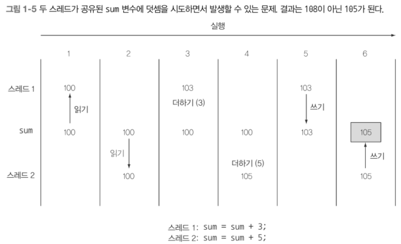
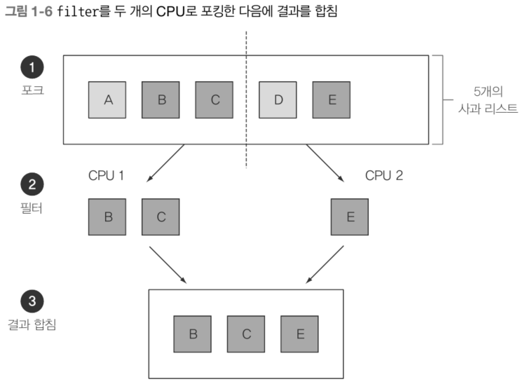

# 자바 8, 9, 10, 11 : 무슨 일이 일어나고 있는가?

## 1.1 역사의 흐름은 무엇인가?
병렬 처리 하려면 자바 8의 신 기능을 쓰는 게 유리

## 1.2 왜 아직도 자바는 변화하는가?
역사적으로 변화하지 않는 언어는 도태

### 1.2.1 프로그래밍 언어 생태계에서 자바의 위치
- 자바의 장점
    - 객체지향 설계, 풍부한 라이브러리, 동시성 지원, JVM 기반 호환성 및 확장성
- 빅 데이터
    - 생태계 변화

### 1.2.2 스트림 처리
- 한 번에 한 개씩 만들어지는 연속적인 데이터 항목들의 모임
    - 입력 스트림 → 출력 스트림
    - C - stdin, stdout
    - Java - System.in, System.out
- Unix의 예
    - cat file1 file2 | tr “[A-Z]” “[a-z]” | sort | tail -3
- 자바의 스트림
    - java.util.stream, Stream<T>
    - 반복문, if문 사용해서 결과 반환하는 것과 달리 db 쿼리처럼 한 줄로 원하는 작업을 연결해서 선언적으로 사용 가능

### 1.2.3 동작 파라미터화로 메서드에 코드 전달하기
- 코드 일부를 API로 전달한다?
    - 메서드를 다른 메서드로 전달?
    - 자바 8부터 가능
    - 동작 파라미터화, behavior parameterization

### 1.2.4 병렬성과 공유 가변 데이터
- 다른 코드와 동시에 실행하더라도 안전하게 실행될 수 있어야 한다. (병렬성)
    ⇒ 공유된 가변 데이터에 접근하지 않아야 한다.
    - 순수 함수, 부작용 없는 함수, 상태 없는 함수
- synchronized는 시스템 성능에 악영향
    - 다중 처리 코어에서는 코드가 순차적으로 실행되어야 하므로 병렬이라는 목적을 무력화 시킴
- 함수형 프로그래밍

## 1.3 자바 함수

- 함수
    - 메서드, 정적 메서드와 같은 의미로 사용
    - 수학적 의미
- 일급 시민
    - 프로그래밍 언어의 핵심은 값을 바꾸는 것
        - 일급 값(시민)
            - 변수에 할당, 함수의 인자로 전달, 함수의 반환값으로 사용 가능
        - 자바의 메서드, 클래스 등 구조체는 값을 표현하는 데 도움
            - 변수에 할당, 함수의 인자로 전달, 함수의 반환값으로 사용 등 불가
            - 이급 값(시민)
    - 메서드를 일급 시민으로 만들면 유용하게 활용 가능 → 자바 8에서 가능

### 1.3.1 메서드와 람다를 일급 시민으로

- 메서드 참조
    - 기존 메서드를 재활용하여 함수를 값으로 전달
- 람다 : 익명 함수
    - 새로운 함수를 즉석에서 생성하여 전달

### 1.3.2 코드 넘겨주기 : 예제

- 클래스 Apple, 메서드 getColor(), 변수 inventory<List>
- 모든 녹색 사과를 선택해서 리스트를 반환하는 프로그램 구현
    - 특정 항목을 선택해서 반환하는 동작, filter 사용하여 filterGreenApples() 구현
    - 자바 8 이전
        
        ```java
        public static List<Apple> filterGreenApples(List<Apple> inventory) {
            List<Apple> result = new ArrayList<>();
            for (Apple apple : inventory) {
                if (GREEN.equals(apple.getColor())) {
                        result.add(apple);
                }
                return result;
            }
        }
        ```
        
        - 색 말고 무게로 필터링 한다면?
            
            ```java
            public static List<Apple> filterHeavyApples(List<Apple> inventory) {
                List<Apple> result = new ArrayList<>();
                for (Apple apple : inventory) {
                    if (apple.getWeight() > 150) {
                            result.add(apple);
                    }
                }
                return result;
            }
            ```
    - 자바 8부터
        
        ```java
        public static boolean isGreenApple(Apple apple) { 
            return GREEN.equals(apple.getColor());
        }
        
        public static boolean isHeavyApple(Apple apple) { 
            return apple.getWeight() > 150;
        }
        
        public interface Predicate<T> { 
            boolean test(T t);
        }
        
        static List<Apple> filterApples(List<Apple> inventory, Predicate<Apple> p) { 
            List<Apple> result = new ArrayList<>();
            for (Apple apple: inventory) { 
                if (p.test(apple)) { 
                        result.add(apple);
                } 
            } 
            return result;
        }
        
        // 메서드 호출
        filterApples(inventory, Apple::isGreenApple);
        filterApples(inventory, Apple::isHeavyApple);
        ```

<aside>
    
    프레디케이트(predicate)란 무엇인가?
    - filterApples는 Predicate<Apple>를 파라미터로 받음
    - 수학에서 인수로 값을 받아 true, false를 반환하는 함수
    
</aside>    

### 1.3.3 메서드 전달에서 람다로
- 익명 함수 람다
    ```java
    // 예시 1
    filterApples(inventory, (Apple a) -> GREEN.equals(a.getColor()));
    
    // 예시 2
    filterApples(inventory, (Apple a) -> a.getWeight() > 150);
    
    // 예시 3
    filterApples(inventory, (Apple a) -> a.getWeight() < 80 || RED.equals(a.getColor()));
    ```
    - 한 번만 사용할 메서드 일 경우
        → 따로 정의할 필요 없이 람다로 간결하게 표현 가능
        - 람다가 몇 줄 씩 길어지면 따로 이름을 부여한 메서드로 구현하는 게 명확함
  ## 1.4 스트림

- 리스트에서 고가의 트랜잭션 Transaction (거래)만 필터링한 다음에 통화로 결과를 그룹화
    - Collection
        
        ```java
        Map<Currency, List<Transaction>> transactionsByCurrencies = new HashMap<>(); 
        for (Transaction transaction : transactions) { 
        		if (transaction.getPrice() > 1000) { 
        				Currency currency = transaction.getCurrency();
        				List<Transaction> transactionsForCurrency = transactionsByCurrencies.get(currency);
        				if (transactionsForCurrency == null) { 
        						transactionsForCurrency = new ArrayList<>();
        						transactionsByCurrencies.put(currency, transactionsForCurrency);
        				} 
        				transactionsForCurrency.add(transaction);
        		} 
        }
        ```
        
    - Stream
        
        ```java
        import static java.util.stream.Collectors.groupingBy;
        Map<Currency, List<Transaction>> transactionsByCurrencies = 
        		transactions.stream()
        					.filter((Transaction t) -> t.getPrice() > 1000)
        					.collect(groupingBy(Transaction::getCurrency));
        ```

### 1.4.1 멀티스레딩은 어렵다

- 스트림 → 라이브러리에서 반복되는 패턴 제공
    - 필터, 추출, 그룹화 등
    - 쉽게 병렬화 가능
- 두 cpu를 가진 환경에서 리스트 필터링
    
- 컬렉션 → 어떻게 데이터를 저장하고 접근할지에 중점
- 스트림 → 데이터에 어떤 계산을 할 것인지 묘사하는 것에 중점
    - 스트림은 스트림 내의 요소를 쉽게 병렬로 처리할 수 있는 환경을 제공한다는 것이 핵심
- 스트림, 람다 → 병렬성 보장
    ```java
    import static java.util.stream.Collectors.toList;
    List<Apple> heavyApples = inventory.parallelStream().filter((Apple a) -> a.getWeight() > 150).collect(toList());
    ```
### 자바의 병렬성과 공유되지 않은 가변 상태
> 함수형 프로그래밍에서 함수형이란 ‘함수를 일급값 으로 사용한다’라는 의미도 있지만 부가적으로 ‘프로그램이 실행되는 동안 컴포넌트 간에 상호 작용이 일어나지 않는다’라는 의미도 포함한다.
> 
## 1.5 디폴트 메서드와 자바 모듈
```java
// 디폴트 메서드 도입 전
Collections.sort(students, comparator);

// 디폴트 메서드 도입 후
myList.sort(comparator)

// List 인터페이스에 추가된 디폴트 메서드
default void sort(Comparator<? super E> c) {
    Collections.sort(this, c);
}
```
- sort()는 원래 Collections 클래스의 정적(static) 메서드로만 존재
- 디폴트 메서드로 Lilst 인터페이스 안에 구현 함으로써 Collections.sort()를 호출 → myList.sort() 사용 가능
    - List 인터페이스에 디폴트 메서드를 구현하지 않으면 List의 모든 구현체에 sort() 구현해야 사용 가능
