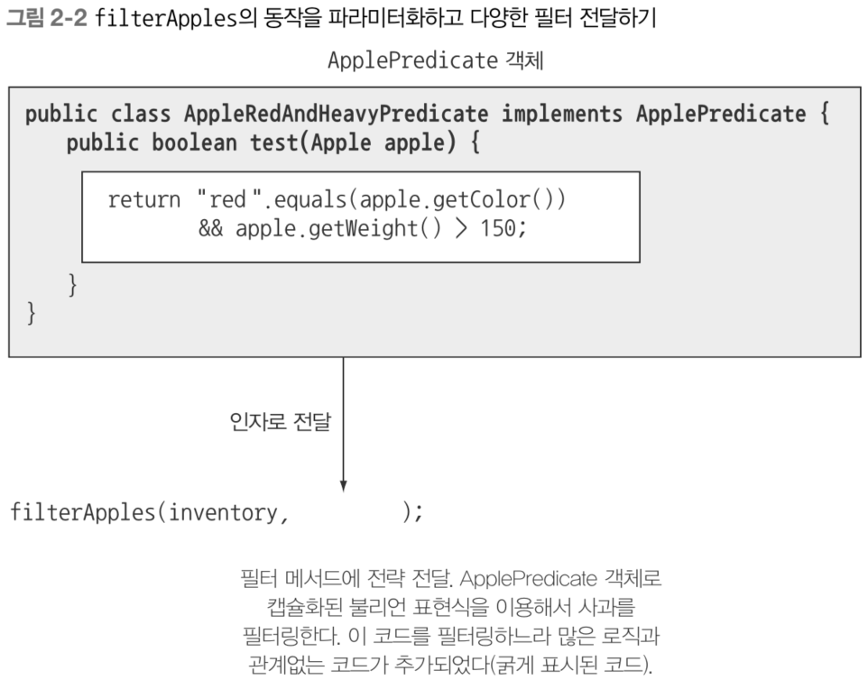
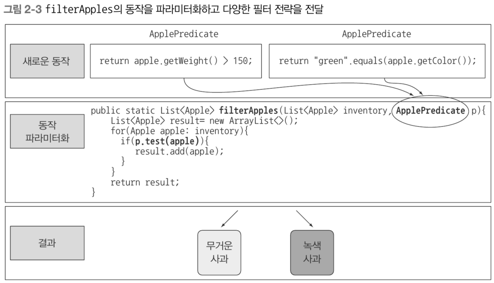

# Chapter 2 동작 파라미터화 코드 전달하기

- 요구사항은 항상 바뀐다.
- 요구사항에 유연하게 대처하면서 새로운 기능의 구현이 쉽고 유지보수가 쉬운 코드를 작성해야 한다.
- 동작 파라미터화
    
    > 동작 파라미터화(behavior parameterization)를 이용하면 자주 바뀌는 요구사항에 효과적으로 대응할 수있다. 동작 파라미터화란 아직은 어떻게 실행할 것인지 결정하지 않은 코드 블록을 의미한다.
    이 코드 블록은 나중에 프로그램에서 호출한다. 즉, 코드 블록의 실행은 나중으로 미뤄진다. 예를 들어 나중에 실행될 메서드의 인수로 코드 블록을 전달할 수 있다. 결과적으로 코드 블록에 따라 메서드의 동작이 파라미터화된다.
    > 
    - 짝수만 출력하는 코드
        
        ```java
        public void printEvenNumbers(List<Integer> numbers) {
            for (int n : numbers) {
                if (n % 2 == 0) {
                    System.out.println(n);
                }
            }
        }
        ```
        
    - 홀수를 출력하거나, 5보다 큰 수를 출력하고 싶다면?
        - 각각 메서드를 다 만든다?
    - 동작 파라미터화 적용
        
        ```java
        public void printNumbers(List<Integer> numbers, Predicate<Integer> condition) {
            for (int n : numbers) {
                if (condition.test(n)) {
                    System.out.println(n);
                }
            }
        }
        ```
        
        - 짝수만 출력
            
            ```java
            printNumbers(list, n -> n % 2 == 0);
            ```
            
        - 홀수만 출력
            
            ```java
            printNumbers(list, n -> n % 2 != 0);
            ```
            
        - 5보다 큰 수만 출력
            
            ```java
            printNumbers(list, n -> n > 5);
            ```
            
    - Interface Predicate<T>
        
        
        | Modifier and Type | Method | Description |
        | --- | --- | --- |
        | boolean | test(T t) | Evaluates this predicate on the given argument. |
        - 동작(메서드, 함수, 2급 시민)을 인자로 직접 전달 불가
        - 함수형 인터페이스를 통해 동작을 객체로 포장 → 1급 시민으로 취급

## 2.1 변화하는 요구사항에 대응하기

- 농장 재고 목록 애플리케이션
    - 농부의 요구사항
        - 녹색 사과만 필터링 하는 기능 추가

### 2.1.1 첫 번째 시도 : 녹색 사과 필터링

- 사과 색 정의
    
    ```java
    enum Color {RED, GREEN}
    ```
    
- 녹색 사과 필터링
    
    ```java
    public static List<Apple> filterGreenApples(List<Apple> inventory) {
        List<Apple> result = new ArrayList<>(); // 사과 리스트
        for (Apple apple : inventory) {
            if (GREEN.equals(apple.getColor()) { // 녹색 사과만 선택
                result.add(apple;)
            }
        }
        
        return result;
    }
    ```
    
- 다른 색의 사과도 필터링 하고 싶다면?
    - 같은 메서드 계속 생성? → 거의 비슷한 코드가 반복되면 추상화

### 2.1.2 두 번째 시도 : 색을 파라미터화

- filterGreenApples를 반복하지 않고 filterRedApples 구현하는 방법은?
- 색을 파라미터화 할 수 있게 메서드에 파라미터 추가
    
    ```java
    public static List<Apple> filterApplesByColor(List<Apple> inventory, Color color) {
        List<Apple> result = new ArrayList<>();
        for (Apple apple : inventory) {
            if (apple.getColor().equals(color)) {
                result.add(apple);
            }
        }
        
        return result;
    }
    
    // 메서드 호출
    List<Apple> greenApples = filterApplesByColor(inventory, GREEN);
    List<Apple> greenApples = filterApplesByColor(inventory, RED);
    ```
    
- 농부가 무게 150그램 이상인 사과를 분류하고 싶다고 한다면?
    
    ```java
    public static List<Apple> filterApplesByWeight(List<Apple> inventory, int weight) { 
        List<Apple> result = new ArrayList<>();
        for (Apple apple: inventory) { 
            if (apple.getWeight() > weight) { 
                result.add(apple);
            } 
        } 
        
        return result;
    }
    ```
    
- 색 필터, 무게 필터 코드 대부분이 중복
    - DRY(don’t repeat yourself) 원칙 위반
    - filter 메서드로 병합?
        - 색이나 무게 중 기준을 가리키는 플래그 추가
        - 실전에서 사용 금지

### 2.1.3 세 번째 시도 : 가능한 모든 속성으로 필터링

- 모든 속성을 파라미터로 추가 → 실전에서 금지하는 이유
    
    ```java
    public static List<Apple> filterApples(List<Apple> inventory, Color color, int weight, boolean flag) { 
        List<Apple> result = new ArrayList<>();
        for (Apple apple: inventory) { 
            if ((flag && apple.getColor().equals(color)) || 
                (!flag && apple.getWeight() > weight)) {
                result.add(apple);
            } 
        } 
        
        return result;
    }
    
    // 메서드 호출
    List<Apple> greenApples = filterApples(inventory, GREEN, 0, true);
    List<Apple> heavyApples = filterApples(inventory, null, 150, false);
    ```

## 2.2 동작 파라미터화

- 변화에 더 유연한 방법이 필요하다.
- 사과의 속성에 기반한 boolean 값을 반환 해보자.
    - 사과가 녹색인가? 사과가 150그램 이상인가?
- Predicate
    - 참 또는 거짓을 반환하는 함수
    - 선택 조건을 결정하는 인터페이스 ApplePredicate 정의
        
        ```java
        public interface ApplePredicate {
            boolean test(Apple apple);
        }
        
        // 무거운 사과만 선택
        public class AppleHeavyWeightPredicate implments ApplePredicate {
            public boolean test(Apple apple) {
                return apple.getWeight() > 150;
            }
        }
        
        // 녹색 사과만 선택
        public class AppleGreenColorPredicate implements ApplePredicate {
            public boolean test(Apple apple) {
                return GREEN.equals(apple.getColor());
            }
        }
        ```
        
        ⇒ 전략 디자인 패턴
        
        - 각 알고리즘(전략)을 캡슐화하는 알고리즘 패밀리를 정의하고 런타임에 알고리즘을 선택
        - 그럼 이제 filterApples가 ApplePredicate 객체를 받아서 사과의 조건을 검사하도록 메서드를 수정해야 한다?
            - 동작 파라미터화 → filterApples 메서드가 ApplePredicate 객체를 인자로 받아야 한다.
            - 메서드가 실행할 동작을 외부에서(파라미터로) 주입 받는다.
            - 색, 무게 두 가지 전략(구현체)을 filterApples 메서드의 인자로 전달하여 상황에 따라 전략을 선택하게 만든다.

### ⁉️ 자바에서 인터페이스는 1급 객체가 아니다.
- 1급 객체의 조건
    1. 변수에 할당할 수 있다.
    2. 함수의 인자로 전달할 수 있다.
    3. 함수의 반환값으로 사용할 수 있다.
- 자바에서 1급 객체는 “객체”이다.
- new로 생성한 인스턴스(구현체)가 변수에 담을 수 있고, 인자로 전달 가능하다.
- 인터페이스는 설계도일 뿐, 인스턴스가 아니다.

### 2.2.1 네 번째 시도 : 추상적 조건으로 필터링

```java
public static List<Apple> filterApples(List<Apple> inventory, ApplePredicate p) {
    List<Apple> result = new ArrayList<>();
    for (Apple apple : inventory) {
        if (p.test(apple)) {
            result.add(apple;)
        }
    }
    
    return result;
}
```

### 코드/동작 전달하기

- 이제 필요한 대로 다양한 ApplePredicate 구현체를 만들어 filterApples로 전달만 하면 된다.
- 농부의 요구 사항 : 150그램 이상의 빨간 사과를 검색
    
    ```java
    // ApplePredicate의 test()를 구현하는 구현체(전략)
    public class AppleRedAndHeavyPredicate implments ApplePredicate {
        public boolean test(Apple apple) {
            return RED.equals(apple.getColor()) && apple.getWeight() > 150; 
        }
    }
    
    // 메서드 호출
    List<Apple> redAndHeavyApples = filterApples(inventory, new AppleRedAndHeavyPredicate());
    ```
    
- ApplePredicate의 구현 객체에 의해 filterApples 메서드의 동작 결정!
  
  

## 2.3 복잡한 과정 간소화
현재 filterApples 메서드로 새로운 동작을 전달하려면 ApplePredicate 인터페이스를 구현하는 여러 클래스를 정의한 다음 인스턴스화 해야 한다.
```java
public class AppleHeavyWeightPredicate implements ApplePredicate {
    public boolean teset(Apple apple) {
        return apple.getWeight() > 150;
    }
}

public class AppleGreenColorPredicate implements ApplePredicate {
    public boolean test(Apple apple) {
        return GREEN.equals(apple.getColor());
    }
}

public class FilteringApples {
    public static void main(String[] args) {
        List<Apple> inventory = Arrays.asList(new Apple(80, GREEN),
                                              new Apple(155, GREEN),
                                              new Apple(120, RED));
                                                                                    
        List<Apple> heavyApples = filterApples(inventory, new AppleHeavyWeightPredicate());
        List<Apple> greenApples = filterApples(inventory, new AppleGreenColorPredicate());
    }
    
    public static List<Apple> filterApples(List<Apple> inventory, ApplePredicate p) {
        List<Apple> result = new ArrayList<>();
        for (Apple apple : inventory) {
            if (p.test(apple)) {
                result.add(apple);
            }
        }
        
        return result;
    }
}
```

### 2.3.1 익명 클래스

- 지역 클래스, 블록 내부에 선언된 클래스

### 2.3.2 다섯 번째 시도 : 익명 클래스 사용

```java
List<Apple> redApples = filterApples(inventory, new ApplePredicate() {
    public boolean test(Apple apple) {
        return RED.equals(apple.getColor());		
    }
});
```

- ApplePredicate의 구현체를 따로 만들지 않고 filerApples()에서 바로 구현
- 장황함, verbosity
    - 여전히 반복되는 코드 존재 → 공간 차지
- 많은 프로그래머가 익명 클래스에 익숙하지 않다?

### 2.3.3 여섯 번째 시도 : 람다 표현식 사용

```java
List<Apple> result = filterApples(inventory, (Apple apple) -> RED.equals(apple.getColor()));
```

- 단일 추상 메서드 인터페이스 조건 충족
- 메서드 시그니처 일치

### 2.3.4 일곱 번째 시도 : 리스트 형식으로 추상화

- 지금까지 filterApples는 사과만 필터링 하는, 타입에 종속된 형태
- 정수, 문자열 등을 필터링 하려면 또 다른 메서드 필요 → 코드 중복
- 제네릭 도입
    
    ```java
    // 모든 타입 T에 대응하는 인터페이스
    public interface Predicate<T> {
        boolean test(T t);
    }
    
    // 모든 타입을 처리하는 범용 필터 메서드
    public static <T> List<T> filter(List<T> list, Predicate<T> p) {
        List<T> result = new ArrayList<>();
        for (T e : list) {
            if (p.test(e)) {
                result.add(e);
            }
        }
        
        return result;
    }
    ```
    
- 실제 사용
    
    ```java
    List<Apple> redApples = filter(inventory, (Apple apple) -> RED.equals(apple.getColor()));
    List<Integer> evenNumbers = filter(numbers, (Integer i) -> i % 2 == 0);
    ```
    
- 자바의 함수형 인터페이스
    
    
    | **인터페이스** | **제네릭 정의** | **입력 → 출력** | **용도** | **실제 사용 예시** |
    | --- | --- | --- | --- | --- |
    | Predicate<T> | <T> | T → boolean | 조건 검사 | (Apple a) → a.getWeight() > 150(150g 이상 사과 필터링) |
    | Function<T,R> | <T, R> | T → R | 타입 변환/추출 | (String s) → s.length()(문자열 → 길이 변환) |
    | Supplier<T> | <T> | () → T | 값 생성/제공 | () → new Random().nextInt()(랜덤 정수 생성) |
    | Consumer<T> | <T> | T → void | 소비 연산 | (String s) → System.out.println(s)(문자열 출력) |

## 2.4 실전 예제

### 2.4.1 Comparator로 정렬하기

- sort 메서드는 List에도 Collections에도 포함되어 있다.
- Comparator를 이용해서 sort의 동작을 파라미터화 하면 기본 정렬보다 유연한 정렬이 가능하다.
    
    ```java
    // java.util.Comparator
    public interface Comparator<T> {
        int compare(T o1, T o2);
    }
    
    // Comparator 정의하여 무게 순으로 정렬
    inventory.sort(new Comparator<Apple>() {
        public int compare(Apple a1, Apple a2) {
            return a1.getWeight().compareTo(a2.getWeight());
        }
    });
    
    // 람다 적용
    inventory.sort((Apple a1, Appple a2) -> a1.getWiehgt().compareTo(a2.getWeight()));
    ```
