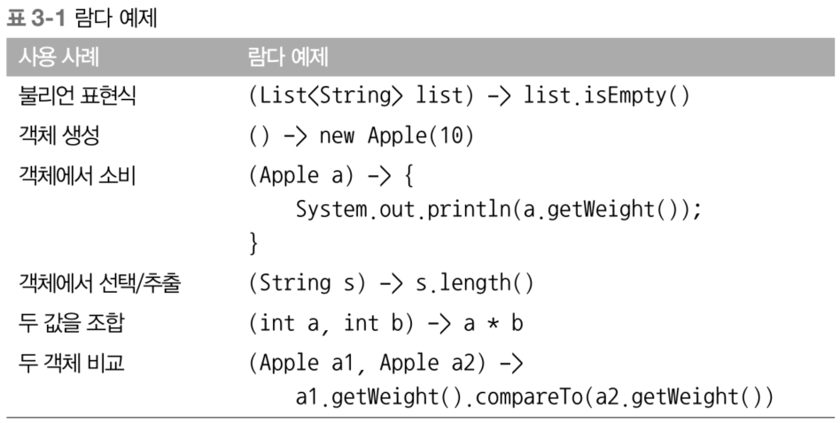
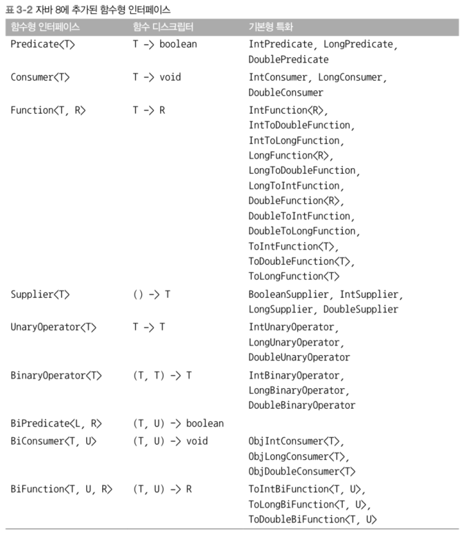
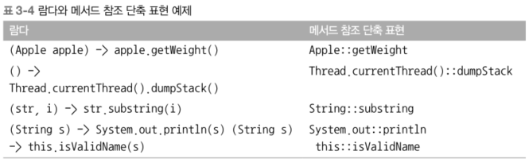

# Chpater 3.

# 람다 표현식

## 3.1 람다란 무엇인가?

- 특징
    - 익명
        - 이름이 없는 메서드
    - 함수
        - 특정 클래스에 종속되지 않음
        - 메서드와 같이 파라미터, 바디, 반환 형식, 예외 리스트 포함
    - 전달
        - 메서드 인수로 전달 또는 변수로 저장 가능
    - 간결성
        - 익명 클래스에 비해 훨씬 간결
- 용어(lambda)
    - 미적분학 학계에서 개발한 시스템에서 유래
- 람다는 왜 이용하는가?
    - 어떤 메서드에 인자로 동작을 외부에서 전달할 때(동작 파라미터화), 간결하게 구현 가능해서
- 구성
    
    ```java
    inventory.sort((Apple a1, Appple a2) -> a1.getWiehgt().compareTo(a2.getWeight()));
    ```
    
    - 파라미터 리스트, 화살표, 람다 바디(실행문)
- 자바 8의 대표적인 람다 표현식
  
  
    
## 3.2 어디에, 어떻게 람다를 사용할까?

- 메서드의 인자로 외부에서 주입되는 동작(함수)이 함수형 인터페이스 타입이면, 동작을 람다로 표현 가능하다.
    - 람다는 함수형 인터페이스가 갖고 있는 단일 추상 메서드의 구현식

### 3.2.1 함수형 인터페이스
- 오직 하나의 추상 메서드를 갖는다.    
    ```java
    // java.util.Comparator
    public interface Comparator<T> {
        int compare(T o1, T o2);
    }
    
    // java.lang.Runnable
    public interface Runnable {
        void run();
    }
    
    // java.awt.event.ActionListener
    public interface ActionListener extends EventListener {
        void actionPerformed(ActionEvent e);
    }
    
    // java.util.concurrent.Callable
    public interface Callable<V> {
        V call() throws Exception;
    }
    
    // java.security.PrivilegedAction
    public interface PrivilegedAction<T> {
        T run();
    }
    ```
    
    > 인터페이스는 디폴트 메서드를 포함할 수 있다. 많은 디폴트 메서드가 있어도 추상 메서드가 하나면 함수형 인터페이스다.
    > 
- 함수형 인터페이스의 추상 메서드 구현을 람다로 구현 후 다른 메서드의 인자(동작)로 전달 가능하므로, 람다 자체를 함수형 인터페이스의 인스턴스라 할 수 있다.
    
    ```java
    함수형 인터페이스 {
        추상 메서드
    }
    
    어떤 메서드((입력 값) -> {원하는 동작})
    ```
    
### 3.2.2 함수 디스크립터

- 함수형 인터페이스의 추상 메서드의 시그니처 ⇒ 람다 표현식의 시그니처
- 시그니처가 일치한다?
    - 함수형 인터페이스의 추상 메서드의 인수와 반환값이 람다의 인수와 반환값과 일치한다.
    - 함수형 인터페이스를 인수로 받는 메서드에만 람다 표현식 사용이 가능하다.
        
        ```java
        public void process(Runnable r) {
            r.run();
        }
        
        process(() -> System.out.println("This is awesome!!"));
        ```
        
        - Runnable의 추상 메서드 run()은 인수와 반환 타입이 없다.
        - () 인수 없음 → System.out.println() void 반환

## 3.3 람다 활용 : 실행 어라운드 패턴

- 람다와 동작 파라미터의 실용 예제
    - 실행 어라운드 패턴
        - 자원 열기(설정) - 실제 작업(처리) - 닫기(정리)
            
            ```java
            public String processFile() throws IOException {
                try (BufferedReader br = new BufferedReader(new FileReader("data.txt"))) {
                    return br.readLine();
                }
            }
            ```
            
            - 설정 : BufferedReader로 읽을 파일을 설정
            - 실행 : 설정된 파일을 한 줄 씩 읽음
            - 정리 : try-with-resource 구문으로 작업 정리

### 3.3.1 1단계 : 동작 파라미터화를 기억하라

- 현재 정의된 processFile()은 한 줄만 읽기 가능
- 한 번에 두 줄을 읽거나 가장 자주 사용되는 단어를 반환하고 싶다면?

### 3.3.2 2단계 : 함수형 인터페이스를 이용해서 동작 전달

- 함수형 인터페이스 자리에 람다를 사용할 수 있다.
    
    ⇒ BufferedReader를 받아서 String을 반환하고, IOException을 던질 수 있는 시그니처와 일치하는 함수형 인터페이스가 필요하다.
    
    ```java
    @FunctionalInterface
    public interface BufferedReaderProcessor {
        String process(BufferedReader b) throws IOException;
    }
    
    // BufferedReaderProcessor를 processFile() 메서드의 인자로 전달
    public String processFile(BufferedReaderProcessor p) throws IOException {
    	...
    }
    ```
    
### 3.3.3 3단계 : 동작 실행

- 이제 함수형 인터페이스 BufferedReaderProcessor에 정의된 process() 메서드의 시그니처(BufferedReader → String)와 일치하는 람다를 전달할 수 있다.
- processFile 바디 내에서 BufferedReaderProcessor 객체의 process 호출 가능
    
    ```java
    public String processFile(BufferedReaderProcessor p) throws IOException {
        try (BufferedReader br = new BufferedRader(new FileReader("dadta.txt"))) {
            return p.process(br); // BufferedReader 객체 처리								
        }
    }
    ```
    
### 3.3.4 4단계 : 람다 전달

```java
String oneLine = processFile((BufferedReader br) -> br.readLine());
String twoLines = processFile((BufferedReader br) -> br.readLine() + br.readLine());
```

## 3.4 함수형 인터페이스 사용

- 오직 하나의 추상 메서드
- 람다 표현식 → 추상 메서드의 구현식
    - 매개변수 타입과 개수, 반환 타입일 일치해야 한다.
- 함수형 인터페이스의 추상 메서드 시그니처를 함수 디스크립터라고 한다.
- 함수형 프로그래밍 지원을 위해 java.util.function 패키지에 다양한 함수형 인터페이스 추가
    - Predicate, Consumer, Function 등

### 3.4.1 Predicate

- 패키지 : java.util.function.Predicate<T>
- 추상 메서드 : test()
- 시그니처 : T 타입의 인자를 받아 Boolean 타입 반환
    
    ```java
    @FunctionalInterface
    public interface Predicate<T> {
        boolean test(T t);
    }
    
    public <T> List<T> filter(List<T> list, Predicate<T> p) {
        List<T> results = new ArrayList<>();
        for (T t : list) {
            if (p.test(t)) {
                results.add(t);
            }
        }
            
        return results;
    }
    
    Predicate<String> nonEmptyStringPredicate = (String s) -> !s.isEmpty();
    List<String> nonEmpty = filter(listOfStrings, nonEmptyStringPredicate);
    ```
    
### 3.4.2 Consumer

- 패키지 : java.util.function.Consumer<T>
- 추상 메서드 : accept()
- 시그니처 : T 타입의 인자를 받아 void 반환
    
    ```java
    @FunctionalInterface
    public interface Consumer<T> {
        void accept(T t);
    }
    
    public <T> void forEach(List<T> list, Consumer<T> c) {
        for (T t : list) {
            c.accept(t);
        }
    }
    
    // 람다가 Consumer의 accept() 구현
    forEach(Arrays.asList(1, 2, 3, 4, 5), (Integer i) -> System.out.println(i));
    ```

### 3.4.3 Function

- 패키지 : java.util.function.Function<T, R>
- 추상 메서드 : apply()
- 시그니처 : T 타입의 인자를 받아서 R 객체를 반환
    - 입력을 출력으로 매핑
        
        ```java
        @FunctionalInterface
        public interface Function<T, R> {
            R apply(T t);
        }
        
        public <T, R> List<R> map(List<T> list, Function<T, R> f) {
            List<R> result = new ArrayList<>();
            for (T t : list) {
                result.add(f.apply(t));
            }
            
            return result;
        }
        
        // [7, 2, 6]
        List<Integer> l = map(
            Arrays.asList("lambda", "in", "action"), (String s) -> s.length();
        )
        ```
        

### 기본형 특화

- 자바의 모든 형식은 참조형 또는 기본형
- 제네릭 파라미터에는 참조형만 사용 가능
    - 박싱 : 기본형 → 참조형
    - 언박싱 : 참조형 → 기본형
    - 오토박싱
        
        ```java
        // int -> Integer
        List<Integer> list = new ArrayList<>();
        for (int i = 300; i < 400; i++) {
            list.add(i);
        }
        ```
        
        - 박싱하면 기본형이 참조형으로 감싸지고 힙에 저장된다.      
            → 메모리 탐색 → 비용 up
          
      - Function 인터페이스는 다양한 출력 형식 파라미터를 제공한다.
        

## 3.5 형식 검사, 형식 추론, 제약

### 3.5.1 형식 검사

- 람다의 형식 추론과 콘텍스트(context)?
    - 람다가 사용되는 상황 즉, 콘텍스트를 보고 컴파일러가 람다의 타입을 추측한다.
    - context
        - 람다가 사용되는 위치, 상황
        - 파라미터? 변수?
        - 그 자리에 어떤 타입의 함수가 필요한지 이미 정해져 있다. → 대상 형식
- 형식 확인 과정
    
    ```java
    List<Apple> heavierThan150g = filter(inventory, (Apple apple) -> apple.getWeight() > 150);
    ```
    
    1. filter 메서드의 선언을 확인한다.
    2. filter 메서드는 두 번째 파라미터로 Predicate<Apple> 형식을 기대한다. → 대상 형식
    3. Predicate<Apple>은 test라는 한 개의 추상 메서드를 정의하는 함수형 인터페이스다.
    4. test 메서드는 Apple을 받아 boolean을 반환하는 함수 디스크립터를 묘사한다.
    5. filter 메서드로 전달된 인수는 이와 같은 요구사항을 만족해야 한다.

> 다이아몬드 연산자
> 
> - <>
>     - 콘텍스트에 따른 제네릭 형식 추론

### 3.5.2 같은 람다, 다른 함수형 인터페이스

- 시그니처만 같다면 어떤 함수형 인터페이스든 같은 형식의 람다로 표현 할 수 있다.
    
    ```java
    Callable<Integer> c = () -> 42;
    PrivilegedAction<Integer> p = () -> 42;
    
    Comparator<Apple> c1 = (Apple a1, Apple a2) -> a1.getWeight().compareTo(a2.getWeight());
    ToIntBiFunction<Apple, Apple> c2 = (Apple a1, Apple a2) -> a1.getWeight().compareTo(a2.getWeight());
    BiFunction<Apple, Apple, Integer> c3 = (Apple a1, Apple a2) -> a1.getWeight().compareTo(a2.getWeight());
    ```
    

### 3.5.3 형식 추론

- 콘텍스트(대상 형식) → 함수 디스크립터 → 람다 시그니처 추론 가능
    
    ```java
    Comparator<Apple> c = (Apple a1, Apple a2) -> a1.getWeight().compareTo(a2.getWeight());
    Comparator<Apple> c = (a1, a2) -> a1.getWeight().compareTo(a2.getWeight());
    ```
    

### 3.5.4 지역 변수 사용

- 람다 캡처링
    - 람다 바디 안에서 외부 변수를 끌어와 사용할 수 있다.
        
        ```java
        public static void main(String[] args) {
            int value = 3;
            List<Intger> list = Arrays.asList(1, 2, 3, 4);
            
            list.forEach(x -> {
                if (x == value) { // 람다 안에서 외부 변수 value 사용
                    System.out.println("같다");
                }
          });
        }
        
        public class Example {
            private String message = "Hello";
            public void printMessage() {
                Runnable r = () -> System.out.println(message); // 인스턴스 변수 캡처
                r.run();
            }
        }
        ```
        
        - 제약 사항
            - 인스턴스 변수, 정적 변수 → 자유롭게 캡처 가능
            - 지역 변수 → final 선언
            - 컴파일 할 수 없는 코드
                
                ```java
                int portNumber = 1337;
                Runnable r = () -> System.out.println(portNumber);
                portNumber = 31337;
                ```
                
                - 지역 변수는 final 또는 final처럼 취급(effectively final)되어야 한다.
                    
                    ⇒ 값이 바뀌면 안된다.
                    
                    - 인스턴스 변수 → 힙 메모리, 지역 변수 → 스택 메모리
                        - 람다에서 지역 변수를 캡처하는 경우 변수 할당이 해제 된 경우에도 해당 변수에 접근하려 할 수 있다.
                        - 이 때문에 자바에서는 변수에 직접 접근이 아닌 복사본을 제공한다.
                        - 복사본의 값은 바뀌지 않아야 한다.
## 3.6 메서드 참조

- 함수형 인터페이스가 요구하는 메서드 시그니처가 일치하는 메서드만 메서드 참조로 전달 가능하다.
    
    ```java
    // 기존 람다 코드
    inventory.sort((Apple a1, Apple a2) -> a1.getWeight().compareTo(a2.getWeight()));
    
    // 메서드 참조로 표현
    inventory.sort(comparing(Apple::getWeight));
    ```
    

### 3.6.1 요약

- 특정 메서드만을 호출하는 람다의 축약형
- **람다 표현식**: 어떤 동작(함수)을 값처럼 전달하는 자바 8의 문법
- **메서드 참조**: 이미 만들어진 메서드(구현)를, 람다처럼 전달할 수 있게 해주는 문법

    

### 메서드 참조를 만드는 방법

1. 정적 메서드 참조
    
    ```java
    Integer::parseInt
    ```
    
    - 정적 메서드? static으로 클래스에 딸려있는 함수 → 객체를 만들지 않아도 사용 가능
    - 객체를 만들지 않고 Integer 클래스의 parseInt() 메서드를 바로 참조
        - 단순히 입력값을 받아 결과 반환
2. 다양한 형식의 인스턴스 메서드 참조
    
    ```java
    String::length
    ```
    
    - 인스턴스 메서드? 생성된 객체에 딸려있는 함수 → 객체를 생성해야 사용 가능
        - 문자열의 길이는 각 String마다 달라
3. 기존 객체의 인스턴스 메서드 참조
    
    ```java
    expensiveTransaction::getValue
    ```
    
    - 특정 객체에 바인딩된 메서드 참조
    - 헬퍼 메서드 활용

### 3.6.2 생성자 참조

- ClassName::new ⇒ new 키워드를 이용한 기존 생성자의 참조
- Supplier의 get 메서드를 호출해서 새로운 Apple 객체를 만들 수 있다.
    
    ```java
    Supplier<Apple> c1 = Apple::new;
    Apple a1 = c1.get();
    ```
    
    ```java
    Supplier<Apple> c1 = () -> new Apple();
    Apple a1 = c1.get();
    ```
    
- Apple(Integer weight) 시그니처를 갖는 생성자는 Function 인터페이스의 시그니처와 같다.
    
    ```java
    Function<Integer, Apple> c2 = Apple::new;
    Apple a2 = c2.apply(100);
    ```
    
    ```java
    Function<Integer, Apple> c2 = (weight) -> new Apple(weight);
    Apple a2 = c2.apply(100);
    ```
    
## 3.7 람다, 메서드 참조 활용하기

사과 리스트를 정렬하면서 동작 파라미터화에서 메서드 참조까지 적용 해보기

### 3.7.1 1단계 : 코드 전달

- sort() 메서드 시그니처
    
    ```java
    void sort(Comparator<? super E> c)
    ```
    
    - Comparator 객체를 인수로 받아 두 인자를 비교한다. → 이미 동작이 파라미터화 되어있다.
        - sort에 전달된 정렬 전략에 따라 다양한 정렬을 할 수 있다.
- 정렬 전략 전달
    
    ```java
    public class AppleComparator implements Comparator<Apple> {
        public int compare(Apple a1, Apple a2) {
            return a1.getWeight().compareTo(a2.getWeight());
        }
    }
    inventory.sort(new AppleComparator());
    ```
    - Comparator를 구현한 구현체를 만들어 sort()에 인자로 직접 전달

### 3.7.2 2단계 : 익명 클래스 사용

- AppleComparator는 sort() 만을 위한 정렬 방법 → 재사용하지 않음 → class로 따로 구현하는 건 비용 발생 → 익명 클래스 사용
    
    ```java
    inventory.sort(new Comparator<Apple>() {
        public int compare(Apple a1, Apple a2) {
            return a1.getWeight().compareTo(a2.getWeight());
        }
    });
    ```
    

### 3.7.3 3단계 : 람다 표현식 사용

- 익명 클래스는 코드가 장황해짐 → 람다로 경량화 가능
    - 함수형 인터페이스를 기대하는 곳은 어디에서나 람다 표현식 사용이 가능하다
    - 함수형 인터페이스는 하나의 추상 메서드를 갖는 인터페이스다.
    - 함수형 인터페이스의 추상 메서드의 시그니처는 함수 디스크립터라 하고, 람다 표현식의 시그니처를 정의한다.
        - 추상 메서드의 함수 디스크립터가 람다의 시그니처를 결정한다.
        - Compartor의 함수 디스크립터 즉, 추상 메서드 compare의 시그니처는 (T, T) → int
            
            ⇒ 람다 표현식도 (T, T) → int 형식이 되어야 한다. 
            
            ```java
            inventory.sort((Apple a1, Apple a2) -> a1.getWeight().compareTo(a2.getWeight()));
            ```
            
- 자바 컴파일러 → 람다 콘텍스트 → 람다 파라미터 형식 추론 → 파라미터 생략 가능
    
    ```java
    inventory.sort((a1, a2) -> a2.getWeight().compareTo(a2.getWeight()));
    ```  
