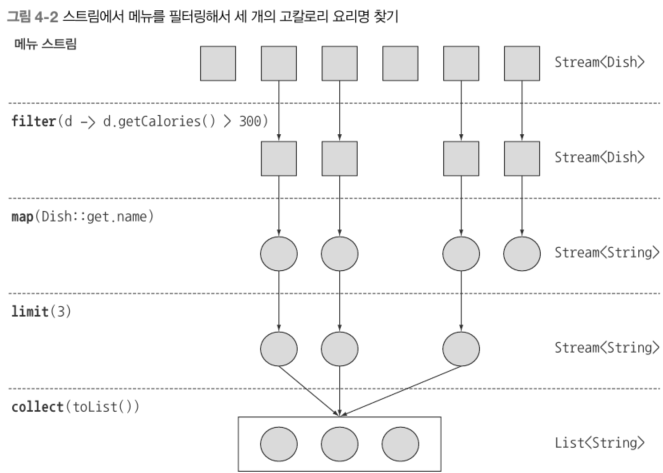

# Chapter 4. 스트림 소개

- 컬렉션(collection)이란?
    - 데이터를 관리하고 처리하기 위한 다양한 자료구조와 이들을 구현한 클래스들의 집합
    - 주요 특징
        - 객체(데이터)를 모아 그룹화한 자료구조
        - 모든 컬렉션은 객체만 저장 가능, 기본형은 Wrapper 클래스를 통해 저장
        - 컬렉션 프레임워크에 각종 자료구조들과 이를 처리하는 다양한 기능 포함
        - 거의 모든 자바 애플리케이션이 컬렉션 사용
- 많은 요소를 포함하는 커다란 컬렉션 즉, 대용량 데이터 집합은 어떻게 처리해야 효율적일까?
    - 대용량 데이터 집합은 성능을 높이려면 병렬 처리가 답이다.
        - 병렬 처리 코드는 복잡하다.
        - 복잡한 코드는 디버깅도 어렵다.
    - SQL 쿼리처럼 선언형으로 다루는 방법은 없나?
        - SQL 쿼리는 어떤 데이터를 선택할지 요구만 표현할 뿐,
        - 어떻게 필터링하고, 어떤 조건인지, 어떻게 반복하고 어떻게 누적하는지 등 세부 구현에 대해 신경 쓸 필요가 없다.
    - 답은 스트림이다.
        - 복잡한 병렬 처리 코드를 SQL 쿼리처럼 선언형으로 컬렉션 데이터 처리가 가능하다.

## 4.1 스트림이란 무엇인가?

- 데이터 컬렉션 반복을 멋지게 처리하는 기능
- 복잡한 멀티스테드 코드를 구현하지 않아도 데이터를 투명하게 병렬로 처리 가능
- 예제
    - 요구 사항
        - 저칼로리 요리의 이름을 반환하고, 칼로리를 기준으로 요리를 정렬한다.
            - 자바 8 이전
                
                ```java
                List<Dish> lowCaloricDishes = new ArrayList<>();
                for (Dish dish : menu) {
                    if (dish.getCalories() < 400) {
                        lowCaloricDishes.add(dish);
                    }
                }
                
                Collections.sort(lowCaloricDishes, new Comparator<Dish>() {
                    public int compare(Dish dish1, Dish dish2) {
                        return Integer.compare(dish1.getCalories(), dish2.getCarlories());
                    }
                });
                
                List<String> lowCaloricDishesName = new ArrayList<>();
                for (Dish dish : lowCaloricDishes) {
                    lowCaloricDishesName.add(dish.getName());
                }
                ```
                
            - 스트림 사용
                
                ```java
                import static java.util.Comparator.comparing;
                import static java.util.stream.Collectors.toList;
                
                List<String> lowCaloricDishesName = 
                            menu.stream()
                                .filter(d -> d.getCalories() < 400)
                                .sorted(comparing(Dish::getCalories))
                                .map(Dish::getName)
                                .collect(toList());
                ```
                
                - parallelStream() 사용하면 멀티코어 아키텍처에서 병렬로 실행 가능
 
### 사용 예제 ⛔
```java
List<Dish> menu = Arrays.asList(
    new Dish("pork", false, 800, Dish.Type.MEAT),
    new Dish("beef", false, 700, Dish.Type.MEAT), 
    new Dish("chicken", false, 400, Dish.Type.MEAT), 
    new Dish("french fries", true, 530, Dish.Type.OTHER), 
    new Dish("rice", true, 350, Dish.Type.OTHER), 
    new Dish("season fruit", true, 120, Dish.Type.OTHER), 
    new Dish("pizza", true, 550, Dish.Type.OTHER), 
    new Dish("prawns", false, 300, Dish.Type.FISH), 
    new Dish("salmon", false, 450, Dish.Type.FISH)
);

public class Dish {
    private final String name;
    private final boolean vegetarian;
    private final int calories;
    private final Type type;

    public Dish(String name, boolean vegetarian, int calories, Type type) {
        this.name = name;
        this.vegetarian = vegetarian;
        this.calories = calories;
        this.type = type;
    }
    
    public String getName() { return name; }
    public boolean isVegetarian() { return vegetarian; }
    public int getCalories() { return calories; }
    public Type getType() { return type; }
    
    @Override
    public String toString() { return name; }
    public enum Type { MEAT, FISH, OTHER }
}
```

## 4.2 스트림 시작하기

- 스트림의 정의
    - 데이터 처리 연산을 지원하도록 소스에서 추출된 연속된 요소(Sequence of delements)
        - 연속된 요소
            - 컬렉션과 같이 스트림은 특정 요소 형식으로 이루어진 연소된 값의 집합을 제공
            - 컬렉션의 주제는 데이터, 스트림의 주제는 계산이다.
                - 컬렉션은 요소 저장 및 접근 연산이 주를 이룬다.
                - 스트림은 계산식이 주를 이룬다.
        - 소스
            - 컬렉션, 배열, 파일 등 다양한 소스에서 생성 가능하다.
        - 데이터 처리 연산
            - filter, map, reduce 같은 함수형 연산으로 데이터를 조작할 수 있다.
- 스트림의 특징
    - 파이프라이닝
        - 스트림 연산끼리 연결해서 파이프라인을 구성할 수 있다.
        - laziness, short circuiting
    - 내부 반복
        - 반복자를 이용해서 명시적으로 반복하는 컬렉션과 달리 스트림은 내부 반복을 지원한다.
- 예제로 확인
    
    ```java
    List<String> threeHighCaloricDishNames = 
        menu.stream()
            .filter(dish -> dish.getCalories() > 300)
            .map(Dish::getName) 
            .limit(3) 
            .collect(toList());
    System.out.println(threeHighCaloricDishNames);
    ```
    
    - filter 메서드로 300 칼로리 이상의 dish 객체들만 걸러냄
    - 걸러진 dish 객체들을 이름을 뽑아서 String으로 변환 → 요리명 추출
    - 앞의 3가지만 선택
    - 결과를 리스트로 저장

> 요리 리스트를 포함하는 menu에 stream 메서드를 호출해서 스트림을 얻었다. 여기서 **데이터 소스**는 요리 리스트(메뉴)다. 데이터 소스는 **연속된 요소**를 스트림에 제공한다. 다음으로 스트림에 filter, map, limit, collect로 이어지는 일련의 **데이터 처리 연산**을 적용한다. collect를 제외한 모든 연산은 **파이프라인**을 형성할 수 있도록 스트림을 반환한다.
>


## 4.3 스트림과 컬렉션

- 컬렉션과 스트림 모두 연속된 요소 형식의 값을 저장하는 자료구조 인터페이스를 제공한다.
- 연속된 → 순차적
- 컬렉션과 스트림의 차이
    - DVD vs. 인터넷 스트리밍
    - 데이터 연산 타이밍
        - 컬렉션의 모든 요소는 컬렉션에 추가하기 전에 계산되어야 한다?
            - 컬렉션은 데이터를 메모리에 저장할 때 이미 어떤 값으로 할당 처리가 되어 있어야 한다. 
            - supplier-driven
            - 적극적 생성 → 모든 값을 계산할 때까지 대기
        - 스트림은 요청할 때만 요소를 계산하는 고정된 자료구조다.
            - 스트림에 요소를 추가하거나 제거할 수 없다.
                - 파이프라인에서 요소를 추가하거나 제거하는 메서드 없음
            - 사용자가 요청하는 값만 스트림에서 추출한다.
            - laziness
                - 요청이 있을 때만 계산

### 4.3.1 딱 한 번만 탐색할 수 있다

- 스트림은 한 번 탐색된 요소는 소비된다.
    
    ```java
    List<String> title = Arrays.asList("Java8", "In", "Action");
    Stream<String> s = title.stream();
    s.forEach(System.out::println); // 이미 소비됨 스트림 닫힘
    s.forEach(System.out::println); // IllegalStateException 발생
    ```

### 4.3.2 외부 반복과 내부 반복

- 컬렉션은 요소를 사용자가 직접 반복, for 루프 → 외부 반복
- 스트림은 어떤 작업을 할 것인지 정의할 뿐 요소를 어떻게 반복할지는 스트림 내부적으로 처리한다. → 내부 반복
    
    ```java
    // for 루프를 이용하는 외부 반복
    List<String> names = new ArrayList<>();
    for (Dish dish : menu) {
        names.add(dish.getName());
    }
    
    // iterator를 이용하는 외부 반복
    List<String> names = new ArrayList<>();
    Iterator<String> iterator = menu.iterator();
    while (iterator.hasNext()) {
        Dish dish = iterator.next();
        names.add(dish.getName());
    }
    
    // 스트림 내부 반복
    List<String> names = menu.stream()
                             .map(Dish::getName) // 중간 연산 로직만 준비
                             .collect(toList()); // 파이프라인 가동 -> 반복 실행
    ```
    
- 내부 반복이 좋은 이유?
    - 내부 반복은 외부 반복과 달리 반복 작업을 자동으로 처리해 병렬 실행과 최적화를 쉽게 지원하며, 개발자는 데이터 처리 로직에만 집중할 수 있어 효율적이고 간결한 코드를 작성할 수 있다.
- 다른 예제
    
    ```java
    // 외부 반복
    List<String> highCaloricDishes = new ArrayList<>();
    Iterator<String> iterator = menu.iterator();
    while (iterator.hasNext()) {
        Dish dish = iterator.next();
        if (dish.getCalories() > 300) {
            highCaloricDishes.add(dish.getName());
        }
    }
    
    // 내부 반복
    List<String> highCaloricDish = menu.stream()
                                       .filter(dish -> dish.getCalories() > 300)
                                       .collect(toList());
    ```
