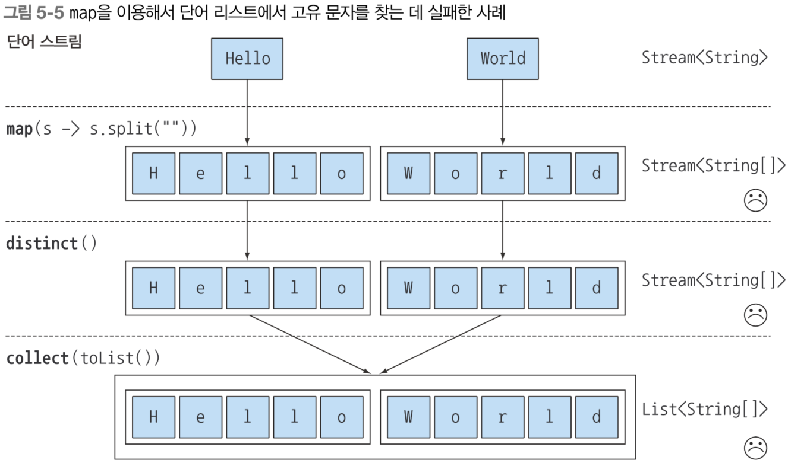

# Chapter 5. 스트림 활용

## 5.1 필터링

### 5.1.1 프레디케이트로 필터링

- filter 메서드
    - predicate를 인수로 받아서 일치하는 요소 반환
        - predicate → boolean을 반환하는 함수
            
            ```java
            List<Dish> vegetarianMenu = menu.stream()
                                            .filter(Dish::isVegetarian)
                                            .collect(toList());
            ```
            
            - Dish 객체의 isVegetarian 메서드(boolean 반환)를 참조하여 반환되는 true인 dish들만 걸러서 리스트로 반환한다.

### 5.1.2 고유 요소 필터링

- distinct 지원 → 고유 요소 반환
    
    ```java
    List<Integer> numbers = Arrays.asList(1, 2, 1, 3, 3, 2, 4);
    numbers.stream()
           .filter(i -> i % 2 == 0)
           .distinct()
           .forEach(System.out::println);
    ```

## 5.2 스트림 슬라이싱

### 5.2.1 프레디케이트를 이용한 슬라이싱

- takeWhile 메서드
    - 스트림 앞에서부터 조건이 true인 요소만 포함하고, false가 반환 되는 순간부터 제외
        
        ```java
        List<Dish> slicedMenu1 = menu.stream()
                                     .takeWhile(dish -> dish.getCalories() < 320)
                                     .collect(toList());
        ```
        
- dropWhile 메서드
    - 스트림 앞에서부터 조건이 true인 요소는 제외하고, false가 반환 되는 지점부터 나머지 요소 포함
        
        ```java
        List<Dish> slicedMenu2 = menu.stream()
                                     .dropWhile(dish -> dish.getCalories() < 320)
                                     .collect(toList());
        ```
        

### 5.2.2 스트림 축소

- limit 메서드
    
    ```java
    List<Dish> dishes = menu.stream()
                            .filter(dish -> dish.getCalories() > 300)
                            .limit(3)
                            .collect(toList());
    ```
    

### 5.2.3 요소 건너뛰기

- skip 메서드
    - 처음 n개의 요소를 제외한 스트림 반환
    - limit 메서드와 상호 보적
        
        ```java
        List<Dish> dishes = menu.stream()
                                .filter(d -> d.getCalories() > 300)
                                .skip(2)
                                .collect(toList());
        ```

## 5.3 매핑

- 매핑이란?
    - 원본 데이터를 원하는 형태로 재배열하거나 변환하는 과정
        - 스트림 객체에서 특정 필드를 추출하는 것 → 선택
        - 다른 타입 객체로 바꾸는 것

### 5.3.1 스트림의 각 요소에 함수 적용하기

- map 메서드
    - 함수를 인수로 받는다.
    - 스트림에 제공되는 각 요소에 함수가 적용된 새로운 요소로 매핑된다.
        - 기존의 값을 고치는 게 아닌 변환에 가까운 매핑
    - 예제
        
        ```java
        List<String> dishNames = menu.stream()
                                     .map(Dish::getName)
                                     .collect(toList());
        ```
        
        ```java
        List<String> words = Arrays.asList("Modern", "Java", "In", "Action");
        List<Integer> wordLengths = words.stream()
                                         .map(String::length)
                                         .collect(toList());
        ```
        
        - "Modern", "Java", "In", "Action" 각 요소에 String::length를 적용해서 각 요소의 계산 결과를 매핑해서 리스트로 반환
        
        ```java
        List<Integer> dishNameLengths = menu.stream()
                                            .map(Dish::getName)
                                            .map(String::length)
                                            .collect(toList());
        ```

## 5.3.2 스트림 평면화

- String 리스트를 받아서 요소를 고유 문자로 이루어진 리스트 반환
    - List<String>
        - “Hello”, “World”
    - 결과
        - "H", "e", "l", "o", "W", "r", "d”
    
    ```java
    words.stream()
    		 .map(word -> word.split(""))
    		 .distinct()
    		 .collect(toList());
    ```
    
    - word 메서드는 String[] 배열을 반환
        
        
        
        ⇒ flatMap 메서드로 해결
        

### map과 Arrays.stream 활용

- 배열 스트림 대신 문자열 스트림이 필요하다.
    
    ```java
    words.stream()
    		 .map(word -> word.split(""))
    		 .map(Arrays::stream)
    		 .distinct()
    		 .collect(toList());
    ```
    
    - List<Stream<String>> 반환

### flatMap 사용

```java
List<String> uniqueCharacters = 
		words.stream()
				 .map(word -> word.split(""))
				 .flatMap(Arrays::stream)
				 .distinct()
				 .collect(toList());
```

- flatMap 메서드
    - word.split(””)으로 만들어진 배열을 펼쳐서(flatten) 요소로 만든다.
        
        
        

# 5.4 검색과 매칭

## 5.4.1 프레디케이트가 적어도 한 요소와 일치하는지 확인

- anyMatch 메서드
    
    ```java
    if (menu.stream().anyMatch(Dish::isVegetarian)) {
    		System.out.println("채식 메뉴")
    } 
    ```
    
    - boolean 반환, 최종 연산자

## 5.4.2 프레디케이트가 모든 요소와 일치하는지 검사

- allMatch 메서드
    - 한 요소(anyMatch)가 아닌, 모든 요소가 프레디케이트와 일치하는지 검사
        
        ```java
        boolean isHealthy = menu.stream()
        												.allMatch(dish -> dish.getCalories() < 1000);
        ```
        
        - 모든 요소가 조건에 맞아야만 true 반환

### NONEMATCH

- allMatch와 반대 연산 수행
    
    ```java
    boolean isHealthy = menu.stream()
    												.noneMatch(d -> d.getCalories() >= 1000);
    ```
    
- anyMatch, allMatch, noneMatch는 스트림 쇼트서킷 기법 즉, 자바의 &&(and), ||(or)와 같은  연산을 활용한다.
    
    > 쇼트서킷. short-circuit
    전기 회로에서 잘못된 연결로 전류가 원래 경로보다 짧은 경로로 흘러 전체 회로를 다 통과하지 않고 흐르는 현상
    &&는 왼쪽 조건이 false면, 오른쪽 조건 skip
    ||는 왼쪽 조건이 true면, 오른쪽 조건 skip
    allMatch, noneMatch, findFirst, findAny 등의 연산은 모든 스트림의 요소를 처리하지 않고도 결과를 반환할 수 있다.
    > 

## 5.4.3 요소 검색

- findAny 메서드
    
    ```java
    Optional<Dish> dish = menu.stream()
    													.filter(Dish::isVegetarian)
    													.findAny();
    ```
    
    - 채식 요리를 filter로 거른 요소들만 match
    - Optaionl 타입 반환

### Optional이란?

- 값이 존재하면 반환, 존재하지 않으면 예외 발생하는 컨테이너 클래스
- finaAny 메서드는 null을 반환할 수 있다.
    - null은 에러를 쉽게 일으킨다.
    - Optional로 값이 없을 때 어떻게 처리할지 강제하여 에러 방지
- 갖고 있는 메서드
    - ifPresent()
        - 값이 있으면 true, 없으면 false
    - ifPresent(Consumer<T> block)
        - 값이 있으면 Consumer block 실행
    - T get()
        - 값이 있으면 값 반환, 없으면 NoSuchElementException 발생
    - T orElse(T other)
        - 값이 있으면 값 반환, 없으면 기본값 반환
    
    ```java
    munu.stream()
    		.filter(Dish::isVegetarian)
    		.findAny()
    		.ifPresent(dish -> System.out.println(dish.getName());
    ```
    
    ⇒ 값이 있으면 출력, 없으면 아무 일도 일어나지 않는다.
    

## 5.4.4 첫 번째 요소 찾기

```java
List<Integer> someNumbers = Arrays.asList(1, 2, 3, 4, 5);
Optional<Integer> firstSquareDivisibleByThree 
		= someNumbers.stream()
								 .map(n -> n * n)
								 .filter(n -> n % 3 == 0)
								 .findFirst();
```

⇒ 9 반환

> findFirst, findAny는 왜 모두 필요할까?
⇒ 병렬 실행에서 첫 번째 요소를 찾기 어렵다. 반환 순서가 상관없다면 제약이 적은 findAny를 사용한다.
> 
- 스트림에서 첫 번째 요소를 찾기 어려운 이유
    - 순서가 보장된 스트림과 그렇지 않은 스트림
        - 스트림은 List 같이 순서가 있는 컬렉션으로 만들 수도 있고, Set, HashMap 같이 순서가 없는 컬렉션으로 만들 수 도 있다.
    - 병렬 스트림에서의 어려움
        - 병렬 스트림은 데이터를 여러 스레드에 분할해서 동시에 처리한다.
        - 별도의 데이터를 chunk 처리 하므로 어떤 스레드가 먼저 결과를 갖고 올 지 모른다.
        - 그래서 첫 번째 요소를 찾기 보다는 임의의 하나의 요소(findAany)를 찾는 게 제약이 적다.
