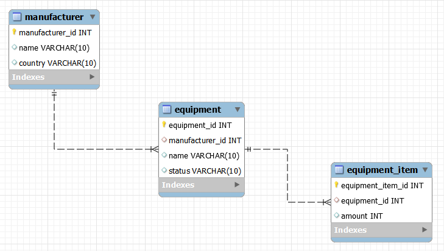

# N+1 문제
# 정의

- 연관 관계가 설정된 엔티티 조회 시, 데이터 개수만큼 연관 관계의 조회 쿼리가 추가로 발생하는 문제
    - 한 번의 조회 쿼리에 연관 쿼리 N번 발생
- 블로그
    - 게시글 + 댓글
    - 게시글 조회 시 댓글을 추가로 조회
        
        ```sql
        SELECT * FROM post;
        
        SELECT * FROM comment WHERE post_id = 1;
        SELECT * FROM comment WHERE post_id = 2;
        SELECT * FROM comment WHERE post_id = 3;
        ```
        

# 발생 이유?

- ORM(Object Relational Mapping)
    - 메모리 상의 객체와 DB의 테이블 스키마를 매핑
    - 테이블 간 관계 설정
- 예제
    
    
    
    - manufacturer - equipment → OneToMany
    - equipment - equipment_item → OneToMany
    - 설비 데이터 조회
        
        ```sql
        SELECT e.* FROM equipment e WHERE e.id = ?
        ```
        
    - 설비의 제조 업자 정보를 조회
        
        ```sql
        SELECT m.*
        FROM manufacturer m
        INNER JOIN equipment e ON e.manufacturer_id = m.manufacturer_id
        WHERE e.id = ?
        ```
        
    - 설비의 아이템을 조회
        
        ```sql
        SELECT ei.* FROM equipment_item ei WHERE ei.equipment_id = ?
        ```
        
        - 왜 manufacturer는 join해서 조회하는가?
            - ManyToOne 관계는 기본적으로 즉시 로딩(eager loading)으로 설정되어 있어 equipment와 함께 조인하여 조회
            - OneToMany는 기본적으로 지연 로딩(lazy loading)으로 설정되어 있어 별도 쿼리로 실행
    - 데이터가 많아지고 관계가 설정되면서 N+1 문제 발생
        - 성능 저하
        - 시스템 자원 낭비
        - 응답 시간 지연

# 해결책

- fetchJoin
    - 모두 한 번에 조회
        
        ```sql
        @Query("SELECT p FROM Post p JOIN FETCH p.comments")
        List<Post> findAllWithComments();
        ```
        
        ```sql
        SELECT * 
        FROM equipment e
        LEFT JOIN manufacturer m ON e.manufacturer_id = m.manufacturer_id 
        LEFT JOIN equipment_item ei ON ei.equipment_id = e.equipment_id
        WHERE e.id = ? 
        ```
        
- @EntityGrpah 설정
    - 조인할 연관 데이터를 미리 지정
    - 관련 엔티티들을 함께 조회하도록 단일 쿼리 생성
